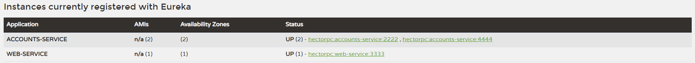

# REPORT
## First Task

- The two services `accounts (2222)` and `web` are running and registered (two terminals, logs screenshots).

First of all, It's necessary to launch a Eureka on port 1111

The next step is to launch the account service on port 2222

.png)

To finish this task it is necessary to launch the web service on port 3333

If everything is correct, this should be displayed at localhost:1111

You can also check the correct functioning of the other two services in localhost:2222

and in localhost:3333

## Second Task

- The service registration service has these two services registered (a third terminal, dashboard screenshots)

As you can see in the previous image of localhost:1111

## Third Task

- A second `accounts` service instance is started and will use the port 4444. This second `accounts (4444)` is also
  registered (a fourth terminal, log screenshots).

As done above, it is necessary to launch another account service instance on port 4444

.png)

If everything is correct, this should be displayed now at localhost:1111

and this at localhost:4444

## Fourth Task

- What happens when you kill the service `accounts (2222)` and do requests to `web`?  
  Can the web service provide information about the accounts again? Why?

First of all, It's necessary to kill the service account on port 2222.

If you try to search for localhost:2222, it won't show up.

On the other side, the first time that you do a request to web It will display:

but the next times It will display:

From my point of view, what is happening is that once It has failed, It redirects the
next requests to the service that It knows is registered and available.

